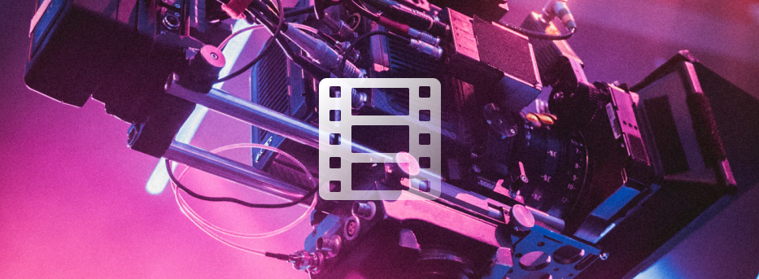

# Wrapper for PL_MPEG - a single header mpeg library.

`nimble install mpeg`


[API reference](https://nimdocs.com/treeform/mpeg)

This library has no dependencies other than the Nim standard library.

## About

https://github.com/phoboslab/pl_mpeg

* MPEG1 Video decoder
* MP2 Audio decoder
* MPEG-PS demuxer

## Encoding

You can encode video in a suitable format using ffmpeg:
`ffmpeg -i input.mp4 -c:v mpeg1video -c:a mp2 -format mpeg output.mpg`

## Test file

You can download test mpeg here: https://phoboslab.org/files/bjork-all-is-full-of-love.mpg

## Example

```nim
# Load mmpeg file (only spesific format is supported)
var plm = plm_create_with_filename("bjork-all-is-full-of-love.mpg")

# Disable audo for now
plm_set_audio_enabled(plm, 0, 0)

# Will use Flippy image library to write images.
# Create an image that will hold 1 frame.
var image = newImage(plm_get_width(plm), plm_get_height(plm), 3)

# For the first 100 frames.
for i in 0..100:
  echo i
  # Deconde a single frame
  var frame = plm_decode_video(plm)
  # Convert a frame to rgb and save it to our image
  plm_frame_to_rgb(frame, addr image.data[0])
  # Save the image.
  image.save(&"tmp/f{i}.png")
```
